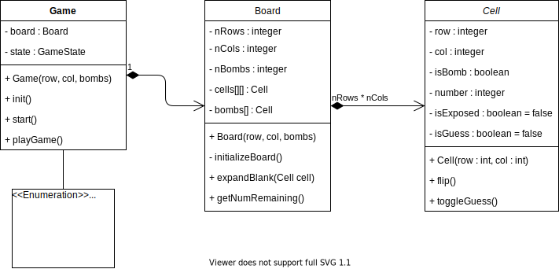

# Démineur

- **Durée**: 6 périodes + travail à la maison
- **Date de rendu**: minuit le jour avant le prochain labo

## Contenu <!-- omit in toc -->

- [Démineur](#démineur)
  - [Objectifs](#objectifs)
  - [Ncurses](#ncurses)
  - [Déroulement du laboratoire](#déroulement-du-laboratoire)
  - [Architecture](#architecture)
    - [Cellule](#cellule)
    - [Terrain](#terrain)
    - [Jeu](#jeu)
  - [Algorithmes](#algorithmes)
  - [Considération de design](#considération-de-design)
  
## Objectifs

On vous demande d'implémenter un démineur en mode texte. La surface de jeu fera 7 x 7 cellules mais elle doit être un paramètre configurable.

Dans chaque cellule vous indiquez le nombre de bombes que la cellule touche. Si c'est une bombe vous indiquez `*`. Vous pouvez aussi indiquer `💣` en utilisant des émoji si votre terminal le supporte (Windows Terminal supporte ce type de caractères).

Voicl le plateau de jeu que l'utilisateur ne doit pas voir en temps normal, car il dévoile les bombes :

```
┌───┬───┬───┬───┬───┬───┬───┐
│   │ 1 │ 1 │ 1 │   │   │   │
├───┼───┼───┼───┼───┼───┼───┤
│   │ 1 │ * │ 1 │   │   │   │
├───┼───┼───┼───┼───┼───┼───┤
│   │ 2 │ 2 │ 2 │   │   │   │
├───┼───┼───┼───┼───┼───┼───┤
│   │ 1 │ * │ 1 │   │   │   │
├───┼───┼───┼───┼───┼───┼───┤
│   │ 1 │ 1 │ 1 │   │   │   │
├───┼───┼───┼───┼───┼───┼───┤
│   │   │   │ 1 │ 1 │ 1 │   │
├───┼───┼───┼───┼───┼───┼───┤
│   │   │   │ 1 │ * │ 1 │   │
└───┴───┴───┴───┴───┴───┴───┘
```

Un clic de souris permet de dévoiler une cellule.

Au démarrage du programme, une grille aléatoire est générée avec un certain nombre de bombes. L'utilisateur voit la grille avec aucune cellule exposée :

```
┌───┬───┬───┬───┬───┬───┬───┐
│ . │ . │ . │ . │ . │ . │ . │
├───┼───┼───┼───┼───┼───┼───┤
│ . │ . │ . │ . │ . │ . │ . │
├───┼───┼───┼───┼───┼───┼───┤
│ . │ . │ . │ . │ . │ . │ . │
├───┼───┼───┼───┼───┼───┼───┤
│ . │ . │ . │ . │ . │ . │ . │
├───┼───┼───┼───┼───┼───┼───┤
│ . │ . │ . │ . │ . │ . │ . │
├───┼───┼───┼───┼───┼───┼───┤
│ . │ . │ . │ . │ . │ . │ . │
├───┼───┼───┼───┼───┼───┼───┤
│ . │ . │ . │ . │ . │ . │ . │
└───┴───┴───┴───┴───┴───┴───┘
```

Cliquez sur une cellule (ligne 1, colonne 0) pourrait donner ceci :

```
┌───┬───┬───┬───┬───┬───┬───┐
│   │ 1 │ . │ . │ . │ . │ . │
├───┼───┼───┼───┼───┼───┼───┤
│   │ 1 │ . │ . │ . │ . │ . │
├───┼───┼───┼───┼───┼───┼───┤
│   │ 2 │ . │ . │ . │ . │ . │
├───┼───┼───┼───┼───┼───┼───┤
│   │ 1 │ . │ . │ . │ . │ . │
├───┼───┼───┼───┼───┼───┼───┤
│   │ 1 │ 1 │ 1 │ . │ . │ . │
├───┼───┼───┼───┼───┼───┼───┤
│   │   │   │ 1 │ . │ . │ . │
├───┼───┼───┼───┼───┼───┼───┤
│   │   │   │ 1 │ . │ . │ . │
└───┴───┴───┴───┴───┴───┴───┘
```

L'utilisateur gagne le jeu lorsque seul les bombes sont exposées :


```
┌───┬───┬───┬───┬───┬───┬───┐
│   │ 1 │ 1 │ 1 │   │   │   │
├───┼───┼───┼───┼───┼───┼───┤
│   │ 1 │ ? │ 1 │   │   │   │
├───┼───┼───┼───┼───┼───┼───┤
│   │ 2 │ 2 │ 2 │   │   │   │
├───┼───┼───┼───┼───┼───┼───┤
│   │ 1 │ ? │ 1 │   │   │   │
├───┼───┼───┼───┼───┼───┼───┤
│   │ 1 │ 1 │ 1 │   │   │   │
├───┼───┼───┼───┼───┼───┼───┤
│   │   │   │ 1 │ 1 │ 1 │   │
├───┼───┼───┼───┼───┼───┼───┤
│   │   │   │ 1 │ ? │ 1 │   │
└───┴───┴───┴───┴───┴───┴───┘
```

Lorsque l'utilisateur clique avec le bouton gauche de la souris, il démine une région. Lorsqu'il clique avec le bouton droit il marque la cellule comme *à risque* (`?`).

## Ncurses

[ncurses](https://en.wikipedia.org/wiki/Ncurses) est une bibliothèque écrite en C et permettant de créer des interfaces graphiques en ligne de commande. Deux exemples vous sont donnés dans le répertoire [ncurses-examples](ncurses-examples). Pour compiler ces exemples vous devez avoir la bibliothèque installée sur votre distribution Linux :

```
apt-get install libncurses-dev
```

Ensuite vous pouvez utiliser :

```
g++ 1.cpp -lncurses
```

Ces deux exemples vous montre comment : 

- Afficher un caractère à une certaine position
- Capturer la position de la souris

Une bonne approche est d'encapsuler toute la complexité de NCurses dans des classes et des méthodes : 

- `displayBoard` Qui affiche le terrain ou met à jour le terrain
- `loop()` Boucle principale qui détecte les clics souris
- `initScreen()` Initialize l'écran
- `freeScreen()` Libère l'écran

Vous avez le choix dans le noms de ces méthodes et dans l'architecture de votre code pour cette partie. 

## Déroulement du laboratoire

Le déroulement suivant est proposé mais c'est à vous de vous organiser :

1. Prise de connaissance des exemples en Ncurses
2. Essai d'un petit programme pour afficher une matrice et obtenir la position d'un clic dans la matrice.
3. Écriture de la classe de gestion de l'affichage
4. Modélisation de l'architecture générale du programme
5. Implémentation de la structure en C++
6. Implémentation des algorithmes demandés
7. Affichage minimaliste de la grille (sans les séparateurs)
8. Gestion clics (capture de la cellule correspondant au clic gauche ou droit)
9. Affichage avancé de la grille (avec les séparateurs)

Vous devez absolument découper votre programme en petites parties fonctionnelles sinon vous vous sentirez au fond du gouffre...

## Architecture

Une bonne approche serait de définir plusieurs classes. À vous de définir ce qui doit être public ou privé. Voici une proposition :

[](https://viewer.diagrams.net/?highlight=0000ff&edit=_blank&layers=1&nav=1&title=Untitled%20Diagram.drawio#R7Vxbc9o6EP41zLRnhjO%2BAIHHmFx6SdM0l6avAgvQiWy5tkggv%2F5IlmxsSwaHYOjheCZN0FpeWft9uyttZVr20FtchiCYfSMuxC3LcBct%2B6xlWYO%2ByX5zwVIIuoMTIZiGyBUicyW4Q69QCg0pnSMXRrmOlBBMUZAXjonvwzHNyUAYkpd8twnB%2BVEDMIWK4G4MsCp9RC6dCWnfOlnJP0E0nSUjm72BuOKBpLOcSTQDLnnJiOzzlj0MCaHik7cYQsxtl9jl8fPyEV899S6%2F%2FIh%2Bgwfn6%2F31z7ZQdvGWW9IphNCnW6tuf20D%2F1cPus7ZQwQ6p%2BTzw3NbzvUZ4Lm0l3%2FLTW4Zf7F%2F%2FpDgSE6eLhOLQt895cCwFgmg37KdGfUwa5nsI7soOWAyAzkRBSFNersIeMR372fITy4lfTuJ4ALhVJXLgJTDkpDOyJT4AJ%2BvpA7AaMpUnWE4YXZxnmFIEUP%2BVIpHhFLisQtiClxfgRMbDCr7RWQejuWtr0%2BTi08%2FO%2F%2F8Cm4ufrwYl6ejL%2B22KcnEJjCFdE3HFW2Yu0HiQRou2X3S15LxpKfZohVCDCh6zj86kF4xTZWkem8IYpNKlXZtI6e1MzDyKsTs5F1Z%2FhQU9QYbFInZK4rYh8xkV6KYnnqqrjVyhqsOAaGr8DN6QR4GPifIhPg0oZCRIcyY4Q5DDWUoCZh0PEPYvQJLMudgMl6On5KWMyMhemVqQULTLI%2BtXq7HHb9TDh3CiPW5SShnpqIrEFHZZ0wwBkGERvED8y4esynyHUlkoYjMfRe6spUGpbhBQ%2FKUhjkzZX5VonNrwEWGaKVUtTt5Mph92X5ZxVizJ2WzTHy1ev2NDL5leQD4U2aEFYu7hfE6lcfLDwcwA94HFDrcjFEtRO0rRG3zYCoDa8s%2B5RoYAaeMgkXyMvvTzZFN0DQKwBj506u4z1lnJbmV8%2Bciwu6d4JgiM%2BS6cbwOCQUUjFK3CLjPxgbqOuyHmXFo%2FN1tddkDDVnbXLXZD%2B8e0iHxGdsAimkFGYVfIKexhnDrnXkz45Z5IDcCbpXzK4f0m2FVc2V7lSOPHNY1QUcmf6NO8Dv97bx9Z%2BAna8Ai%2BA7xRg36NaN%2F0jk0%2BqYW%2FTG7NYqteyZ%2FJ0QQShsW7JIFprFlyt8dDSwtDUZxDGgIUDsBKi8BaiOArRBAARmjeOeR2RKrq%2FINDPAYlvH%2BVkJ%2Bzxlx1jYVWtgqLWwNBTAYQXxDIkQR4fpD0bdAjYOt7MyuVQ3XNTuH98Ha0cDK5mvE%2B8sPvHjBfIWXqLD4EHv8x6Pz7%2FoQ7h08dHe1oRv5zCcYXq9QQN1gWh3T%2Fh6jsbZ2qdaDhNfCRQB8l0U9%2F%2BmD1MNXaseKrQJZZbjL99pmxYhcG7ZqCUVgO4X0eu7dQo9Zgxn%2FaB22DlDtQ2%2Bi1T20dplcUr%2B1mvrt7uq3PatC%2FfZkd%2FVby%2F4P1W%2B1S4V4FXjkdZ6KgcaozLY1tVs9uepa%2FmkhjdfzRw7pTvfsbwZet7PbK%2FDqhj1e9ke8bptiPyIEQ%2BA32O8U%2BxPNcqMu7LVrSH0c9%2BfeiPt54%2FfvWmyWnGRIa7Wakv1ewddHfBSdLwISMbsovm%2FEvYwJwBFs2LBbNtiVF5c1sUEt8Ak2XM5hFDVc2CcXuodeC%2BqKvU0N%2F3253uxXXOjVVcJXy7uiXsTv%2FVDYumWK%2BSvhsRaSasB6cOhoXgb2BKOgqQhWDsWWucdQrAWyVwIkJdMphnFybvCsjmdnj7tt%2FY5LrfBeAk9dQpVUeLNp9U%2Bq8ArRN7DIdXxr3bcS7OXV3dJSblK5fetJXLN4fnt3NNDvvEfitLbMufqz29K3xXJrSDBhFDjziaAKwrggOu4YsMbH3n9MtrYYoP%2BfduaDFKbg86hwJyQNAXZLgKqHaeojgFp6Kdtgqbuqt0P8J2%2B0aoBXV1Wt6ayU%2FvF0R%2BAc6dJrjkoxttnmKg02Hr87Shz8II7meLTgBD9eVb6AbxDfFnHz4OdztCdhHZHnwwbzOjDf5%2FEdPea6xM4xDzBYxuH%2FY2totU6NBvydg9%2Fb4ysw%2BgdUy%2BamgvP%2F%2Bs3wtRWRjW%2BGlx3eq%2FPV8JRBiVa7UBGo%2Bmq4bW1QtLtXw%2FVW1hUSezhetucY2vs959%2FWIMszYi9qBIt4X8ojmZC34wjDr3Uy13gQa0te8WuyQpXqZJ%2Bm8m88MsoIgMdDFlZb5%2F7cgyGI9xrJhfxNOZ3MOqg4zihUJIkgs81O7x8VezNZUJTNQm625Ls8khma5ZPdyszCOVM7F3U%2Ffr9e94x1DHn1%2Fe5%2B32PePlxff76%2B3Pew5fTJP0EhxOuTcSHcZtLuJI7aosybif68fQE8hHnE%2BATxM%2BRa8wmjUjbdomA66OaCVScJXtncamtya%2FoC4u6Tq%2B5VhvLcKpdJ2dy6MSEeItGtidUqOO%2FMZUoK2vZrTjr9DYq2zmWsufqyINF99Y1L9vm%2F)

### Cellule

- `int ligne` Ligne ou se situe la cellule
- `int column` Colonne ou se situe la cellule
- `bool isBomb` Est-ce une bombe ou une cellule vide ?
- `int number` Nombre de bombes en voisinage proche
- `bool isExposed` Est-ce que la cellule est dévoilée ?
- `bool isGuess` Est-ce que la cellule est un candidat de bombe `?` ?

Une cellule est réalisée avec un constructeur à deux paramètres : `row`, `column`. Chaque instance possède deux méthodes :

- `flip()` pour rendre la cellule visible (action clic gauche)
- `toggleGuess()` pour marquer la cellule comme un candidat de bombe (action clic droit)

### Terrain

Le terrain de jeu `Board` est une classe comportant les paramètres suivants :


- `int nRows` : Nombre de lignes
- `int nCols` : Nombre de colonnes
- `int nBombs` : Nombre de bombes
- `Cell[][] cells` : toutes les cellules (à vous d'utiliser la bonne structure de donnée pour sauver les cellules `[][]` n'est pas du C++ valide)
- `Cell[] bombs` : une liste de **références** sur toutes les bombes
- `int numUnexposedRemaining` : nombre de cellules restantes à être dévoilées

Le constructeur prends en paramètre le nombre de lignes, le nombre de colonnes et le nombre de bombes à créer. 

Une méthode privée `initializeBoard()` instancie les cellules et initialise le terrain de jeu. Cete méthode est appelée par le constructeur de classe.

`flipCell(Cell cell)` permet de changer l'état d'une cellule. `expandBlank(Cell cell)` permet d'étendre la surface valide jusqu'aux frontières à proximité des bombes. `getNumRemaining()` retourne le nombre de cellules restantes à retourner.

### Jeu

La classe `Game` stoque les références sur le terrain et les cellules, ainsi que l'état du jeu.

## Algorithmes

Il y a plusieurs algorithmes à implémenter dans ce labo :

- Placer les bombes
- Numéroter les cellules
- Étendre une région

Pour placer les bombes, la meilleures solution est de créer une méthode `shuffleBoard()` qui va mélanger le terrain de jeu en utilisant l'algorithme de [Fisher-Yates](https://en.wikipedia.org/wiki/Fisher%E2%80%93Yates_shuffle). De cette façon il suffit de placer les bombes dans les premières cases du terrain et de mélanger le terrain. 

Numéroter les cellules est de déterminer pour chaque cellule les bombes à proximité. Pour ce faire il faut détecter les proches voisins en utilisant une matrice de voisinage : 

```c
int deltas[][2] = {
    {-1, -1}, {-1, 0}, {-1, 1},
    { 0, -1}, { 0, 0}, { 0, 1},
    { 1,  1}, { 1, 0}, { 1, 1}
};

Pour chaque bombe référencées dans la table des bombes, la matrice de voisinage est parcourue et les cellules environnantes sont incrémentées.

Étendre une région peut être résolu itérativement ou récursivement. C'est l'algorithme le plus difficile de ce labo. La solution récursive est généralement plus facile à implémenter.
```

## Considération de design

Dans ce labo, il n'y a pas de raison d'utiliser d'allocation dynamique hormis pour les listes de cellules dont la taille n'est pas connue avant la création de l'objet. Dans votre première implémentation utilisez simplement un tableau statique à deux dimensions `Cell cells[7][7]`. Par la suite lorsque cela fonctionnera, vous pourrez remplacer ce tableau par un vecteur multidimensionnel dynamique. 

Dans ce labo, il n'y a pas d'héritage, les classes restent simples. 

Commencer par développer votre programme dans un seul fichier, puis lorsque tout fonctionne découpez votre programme en fichiers séparés : `game.cpp`, `board.cpp`, `main.cpp`...

Faites un *flowchart* sur papier pour bien saisir le déroulement de votre programme. Par exemple: 

1. Créer une instance de jeu
2. Initialiser les grilles
3. Initialiser l'écran
4. Afficher la grille
5. Entrer dans la boucle itérative du jeu
6. Terminer le jeu
7. Libérer l'écran
8. Quitter le programme

